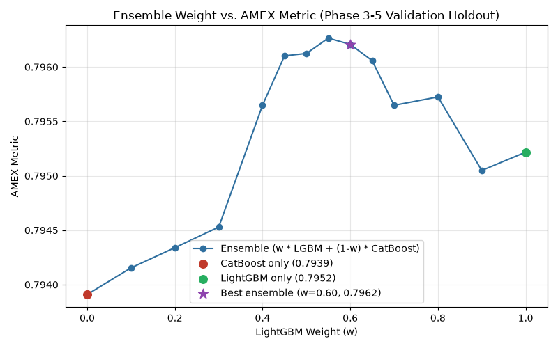

# American Express Default Prediction

Predicting whether a credit card customer will default, based on their longitudinal monthly
financial behavior. Built on Kaggle's [American Express - Default Prediction](https://www.kaggle.com/competitions/amex-default-prediction)
competition dataset — but structured as a credit-risk modeling project, not a leaderboard
chase.

Each customer here isn't a single snapshot: they show up as a sequence of monthly account
statements, and whether they default is a judgment that has to be inferred from both their
current state and how they got there. That longitudinal-to-customer-level transformation —
and whether it actually yields useful predictive signal — is the central question this
project works through.

**Central question:** can a customer's longitudinal financial behavior be transformed into
useful customer-level signals for predicting future default?

## Project Overview

```
Monthly Customer Statements
        ↓
Data Understanding & EDA
        ↓
Customer-Level Feature Engineering
        ↓
Stratified Validation
        ↓
Logistic Regression · LightGBM · CatBoost
        ↓
AMEX Evaluation Metric
        ↓
Feature Ablation & Efficiency Analysis
        ↓
Targeted Model Optimization
        ↓
Ensemble & Final Model Selection
        ↓
Full-Data Retraining, Test Inference & Submission
```

This repository currently covers **Phases 1–7**: data understanding, feature engineering,
baseline modeling, feature ablation, targeted model optimization, ensemble/final model
selection, and full-data retraining with unseen-test inference. Each phase is one fully
executed, self-contained notebook.

## Dataset

Source: Kaggle's AMEX Default Prediction training data, verified directly from the raw
files (`notebooks/01_data_exploration.ipynb`):

- **5,531,451** statement-level rows, **190** columns
- **458,913** unique customers
- Up to **13** monthly statements per customer — **84.1%** of customers have the full
  13-statement history
- Statement dates span **2017-03-01** to **2018-03-31**
- Default rate: **25.89%**

One raw row represents one customer's financial state at one monthly statement date — not
one row per customer. Features fall into five families by prefix:

| Prefix | Family | Count |
|---|---|---|
| `D_` | Delinquency | 96 |
| `B_` | Balance | 40 |
| `R_` | Risk | 28 |
| `S_` | Spend | 21 |
| `P_` | Payment | 3 |

Missingness is substantial and unevenly distributed — 33 features are missing in over 25%
of statements — and Phase 1 treats that as a signal worth preserving rather than a defect
to immediately impute away.

## Feature Engineering

The raw data is statement-level (~5.5M rows); the prediction target is customer-level.
Phase 2 (`notebooks/02_feature_engineering.ipynb`) collapses one into the other:

```
5,531,451 monthly observations
            ↓
   Customer-level aggregation
            ↓
       458,913 customers
```

**Continuous features** get seven aggregates each: `mean`, `std`, `min`, `max`, `first`,
`last`, and `change` (`last - first`). Each captures something different — `mean` is the
customer's typical historical state, `last` is where they stand most recently, and `change`
is the direction they've been moving. A customer with an unremarkable average balance but a
sharply rising `change` looks very different from one whose average looks the same but is
declining.

**Categorical features** (both true string categories and small-integer-coded ones,
identified through explicit cardinality and value inspection rather than assumed from
dtype) get three fields each: `first`, `last`, and the number of distinct categories
observed.

A selective set of customer-level **missing-rate** features and two general **history**
features (statement count, history span in days) round out the set. In total, Phase 2
produces **1,299 engineered features** across 458,913 customers before any
modeling-stage exclusions.

## Memory-Efficient Processing

The raw training CSV is ~15GB; the development machine has ~8GB of RAM. Naively loading
the full file was never an option, so the pipeline is built around **streaming, chunked
processing**: Phase 2's entire customer-level feature set — all 1,299 features — is
produced in a **single full pass** over the raw CSV (56 chunks, 1.84 minutes), using
boundary-aware grouping to aggregate correctly across chunk edges without ever holding the
full dataset in memory.

The resulting customer-level table is saved locally as Parquet
(`data/processed/train_features.parquet`, ~2.6GB) — Phase 3 loads that instead of
re-reading the raw CSV. Both raw and processed competition data are excluded from version
control (see [Reproducibility / Data Access](#reproducibility--data-access)).

## Validation Strategy

Phase 3 (`notebooks/03_baseline_modeling.ipynb`) uses a reproducible **customer-level
stratified holdout**:

- 80% train / 20% validation, stratified by `target`, random seed 42
- **367,130** training customers, **91,783** validation customers
- Default rate: **25.89%** in both splits

This is a **random stratified split, not a temporal or out-of-time split** — the processed
dataset has no defensible customer application-time ordering to validate against, so no
claim of temporal generalization is made here. All three models are trained and evaluated
on the exact same validation customers, making the comparison direct.

## Evaluation Metric

Results are reported using the official AMEX competition metric, which combines two
components:

```
AMEX Metric = 0.5 × Normalized Weighted Gini + 0.5 × Top-4% Default Capture
```

Gini measures overall ranking quality across the full population; top-4% capture measures
whether the model concentrates actual defaulters near the very top of its risk ranking —
the slice a real credit operation could act on. Plain ROC AUC is also reported for
interpretability, but on its own it can't distinguish models that rank the bulk of
customers similarly yet disagree specifically on the highest-risk tail.

## Baseline Models

Three model families, trained on identical features and the identical validation split,
with sensible baseline configurations rather than tuned ones:

- **Logistic Regression** — a linear benchmark.
- **LightGBM** — gradient-boosted trees, non-linear interactions, native categorical
  support.
- **CatBoost** — gradient-boosted trees with a different native categorical-handling
  approach.

## Results

Holdout validation results (not Kaggle leaderboard scores):

| Model | ROC AUC | Normalized Gini | Top-4% Capture | AMEX Metric | Train Time |
|---|---|---|---|---|---|
| Logistic Regression | 0.9604 | 0.9207 | 0.6506 | 0.7856 | 27.0s |
| LightGBM | 0.9621 | 0.9242 | 0.6594 | 0.7918 | 170.8s |
| CatBoost | 0.9626 | 0.9252 | 0.6620 | 0.7936 | 1278.9s |

CatBoost is the strongest of these three full-feature baselines, with LightGBM close behind
and training substantially faster. Logistic Regression is surprisingly competitive given its
much simpler functional form — the gap to the tree-based models is real but modest, not a
landslide. That's itself informative: it suggests the engineered customer-level features
already carry substantial linearly-separable predictive structure, and the trees are
extracting incremental (not transformative) value on top of it.

(Phase 4 later found that a smaller, 852-feature configuration edges out this full-feature
CatBoost result slightly — see [Feature Ablation](#feature-ablation-phase-4) — but that
+0.0003 difference is within the noise of a single fixed validation split, so it doesn't
change the qualitative picture above. The more useful Phase 4 finding is about feature
*efficiency*, not a new leaderboard-topping score.)

## Feature Ablation (Phase 4)

Phase 3's feature importance showed `last`-aggregated features dominating both tree models.
Phase 4 (`notebooks/04_feature_ablation.ipynb`) turns that observation into a controlled
question: **how much predictive value comes from a customer's latest financial state versus
historical summaries, temporal change, and missingness information?** Using LightGBM (close
to CatBoost in Phase 3, far cheaper to run repeatedly) with Phase 3's exact hyperparameters,
split, and metric — unchanged across every experiment, so only the feature set varies — six
additive feature sets were compared:

| Feature Set | # Features | AMEX Metric |
|---|---|---|
| Latest only | 180 | 0.7889 |
| Historical summary only | 672 | 0.7740 |
| Latest + Historical | 852 | **0.7935** |
| + Temporal change | 1,188 | 0.7924 |
| + Missingness | 1,213 | 0.7929 |
| Full (Phase 3 baseline) | 1,239 | 0.7918 |

**Main findings:**

- A customer's **latest statement alone** — 180 features, 14.5% of the full set — already
  reaches AMEX 0.7889, close to the full model's 0.7918.
- **Historical summary statistics alone** (mean/std/min/max, no latest state) are
  substantially weaker at 0.7740 — recency matters more than long-run averages on their own.
- **Combining latest state with historical summaries** produced the strongest LightGBM
  configuration found: AMEX 0.7935 using 852 features — about **31% fewer features than the
  full 1,239-feature baseline**, while *improving* on its 0.7918.
- **Adding temporal change** (`first`, `change`) on top of that reduced the metric by about
  0.0011 — a negligible, slightly negative effect on this split.
- **Adding the selective `_missing_rate` features** improved the metric by only about
  +0.0005 — negligible incremental value from the existing (Phase 2, >25%-missingness)
  selection.
- **CatBoost confirmation:** re-running CatBoost on just the 852-feature "Latest +
  Historical" set scored AMEX 0.7939, against 0.7936 for Phase 3's full-feature CatBoost —
  the same conclusion holds across both model families.

**A caution on the size of these differences:** all of the above comes from a single fixed
stratified holdout split, not cross-validated across multiple folds. Differences on the
order of 0.0003–0.0011 are small enough that they shouldn't be read as one configuration
being definitively better — the meaningful result here is that a substantially smaller
feature set matches or slightly exceeds the full one, not the exact decimal by which it does
so.

*Implementation note:* Phase 4 made LightGBM's categorical missing-value handling explicit
(filling missing categories before training) rather than relying on it happening as a side
effect of Phase 3's Logistic Regression preprocessing running first in the same notebook.

## Model Optimization (Phase 5)

Phase 5 (`notebooks/05_model_optimization.ipynb`) formally adopted Phase 4's 852-feature
"Latest + Historical" configuration as the modeling feature set and ran a small, targeted,
compute-aware optimization pass on LightGBM and CatBoost — deliberately **not** an
exhaustive grid search or a large-scale Optuna study, in keeping with this project's
resource constraints (~8GB RAM). All Phase 3–5 comparisons use the same fixed stratified
holdout split; repeated experimentation against a single holdout risks validation-set
overfitting, so small metric differences throughout this section are read cautiously
rather than treated as proof of a better model.

| Model | Configuration | AMEX Metric |
|---|---|---|
| LightGBM | Phase 4 baseline (852 features) | 0.7935 |
| LightGBM | **Tuned** (L1/L2 regularization) | **0.7952** |
| CatBoost | Phase 4 baseline (852 features) | 0.7939 |

**LightGBM — a confirmed, reproducible improvement.** Seven targeted variations were
tried (tree complexity, minimum-leaf regularization, stochastic subsampling, L1/L2
regularization, and combinations of what worked). The best configuration adds L1/L2
regularization (`reg_alpha=1.0, reg_lambda=1.0`) on top of the Phase 4 baseline
hyperparameters, raising the AMEX metric from 0.7935 to 0.7952 (**+0.0018**) — reproduced
twice with a 0.0000 difference between runs.

Decomposed by metric component, the improvement is uneven: normalized Gini moved only
+0.0005, while top-4%-default-capture moved +0.0030. In plain terms, the tuned model
didn't meaningfully change its overall ranking quality — it got better specifically at
concentrating actual defaulters among the customers it flags as highest-risk, which is the
more operationally relevant half of the metric.

One implementation detail surfaced along the way: the baseline's `subsample=0.8` setting
had been configured without LightGBM's required `subsample_freq`, so row-level subsampling
had silently never been active in any earlier phase (LightGBM's own documentation:
`subsample_freq` defaults to 0, meaning "no enable"). Explicitly activating it
(`subsample_freq=1`) was tested on its own and helped modestly (+0.0006); interestingly,
combining it with L1/L2 regularization performed slightly worse than L1/L2 alone, so the
selected configuration uses L1/L2 regularization only.

**CatBoost — inconclusive, reported honestly.** The reproducible 852-feature CatBoost
baseline remains **AMEX ≈ 0.7939**, unchanged from Phase 4. Every attempt to tune CatBoost
away from that exact baseline configuration — different tree depth, different
regularization, different learning rate — was terminated by the local environment during
training, both when run inside a notebook and as standalone scripts outside Jupyter
entirely, while the untouched baseline configuration itself completed cleanly every time it
was tried. This points to an environment-specific instability with non-baseline CatBoost
runs on this dataset, not a memory shortage or a code defect. One tuning attempt did
complete before an unrelated interruption and showed a promising result, but it could not
be reproduced in several follow-up attempts — it is **not presented as a validated result**
here, only as an unreplicated lead worth revisiting with more stable compute. Further
retries were intentionally stopped rather than continuing to fight an unstable environment.

## Ensemble & Final Model Selection (Phase 6)

Phase 6 (`notebooks/06_ensemble_and_model_selection.ipynb`) asks a narrower question than
Phases 3–5: given the two already-tuned Phase 5 models, does a simple weighted blend of
their saved validation predictions improve on either model alone? No model is retrained in
this phase — it operates entirely on the two prediction files Phase 5 saved to
`data/processed/`, explicitly aligned by `customer_ID` (row order is not assumed to match
between the two files), with both models' AMEX metrics reproduced from those saved files
before any ensemble analysis:

- Tuned LightGBM (Phase 5): AMEX = **0.79522**
- CatBoost baseline (Phase 5): AMEX = **0.79391**

**Model complementarity.** The two models are highly correlated but not identical: Pearson
correlation of raw predicted probabilities is **0.9936**, and Spearman rank correlation is
**0.9856** — measurably lower, indicating real disagreement in how the two models order
customers by risk even where their raw scores track closely. A diagnostic comparison of
each model's own unweighted top-~4%-by-count highest-risk customers (labeled explicitly
here as a diagnostic ranking check, **not** the official weighted AMEX Top-4% Capture
metric, which uses sample weights and is reported separately below) found the two models
agree on **88.9%** of that band (3,262 of 3,671 customers) — leaving roughly **11%** of the
customers each model calls "highest-risk" disagreeing between them. In short: the models
are highly correlated but not identical, and the remaining rank disagreement provides
enough complementary information for a simple blend to improve validation performance.

**Ensemble experiment.** Phase 6 tested simple weighted probability averaging,
`ensemble = w × LightGBM + (1 − w) × CatBoost`, across a coarse 0.1-increment weight grid
from `w=0.0` (CatBoost alone) to `w=1.0` (LightGBM alone):

| LGBM Weight | Normalized Gini | Top-4% Capture | AMEX Metric |
|---|---|---|---|
| 0.0 (CatBoost only) | 0.9247 | 0.6631 | 0.7939 |
| 0.5 | 0.9255 | 0.6667 | 0.7961 |
| **0.6 (selected)** | **0.9255** | **0.6669** | **0.7962** |
| 0.7 | 0.9254 | 0.6659 | 0.7957 |
| 1.0 (LightGBM only) | 0.9246 | 0.6658 | 0.7952 |

The strongest coarse-grid result was **60% tuned LightGBM + 40% CatBoost**, AMEX = 0.79621
— an improvement of **+0.00099** over LightGBM alone and **+0.00230** over CatBoost alone.

Because the two best coarse weights (0.5 and 0.6) were adjacent, a limited 0.05-increment
local refinement was run around them (per the project's own anti-overfitting rule for this
phase: no finer than 0.05, and only because the coarse optimum sat in a broad region rather
than one isolated spike). The refinement's numerical maximum landed at **55% LightGBM / 45%
CatBoost, AMEX ≈ 0.79627** — but that is only **+0.00006** above the 60/40 result, well
below this project's own "negligible" threshold (0.0003). **60/40 was kept as the selected
configuration, not 55/45**, because: the extra refinement gain was negligible; AMEX scores
across roughly w=0.45–0.65 form a broad plateau rather than depending on one isolated
weight; and 60/40 is simpler and avoids optimizing the ensemble weight any more finely
against the same fixed holdout than necessary.

**Metric decomposition.** Unlike Phase 5 — where LightGBM's tuning gain came almost
entirely from top-4% capture (Gini +0.0005, top-4% +0.0030) — Phase 6's ensemble gain over
tuned LightGBM was more evenly split between the two AMEX components:

- Normalized Gini: 0.92461 → 0.92550 (Δ +0.00089)
- Top-4% Capture: 0.66583 → 0.66692 (Δ +0.00109)
- AMEX Metric: 0.79522 → 0.79621 (Δ +0.00099)

Both components moved by a comparable amount, meaning the ensemble both ranks the overall
population slightly better *and* concentrates actual defaulters slightly better among its
highest-risk predictions — not one improvement at the expense of the other.



**Final model selection.** The modeling strategy selected for Phase 7 is **60% tuned
LightGBM + 40% CatBoost** (AMEX = **0.79621**). Despite CatBoost's weaker standalone score,
it earns a meaningful weight in the blend because it contributes ranking information
LightGBM's predictions don't fully capture on their own — consistent with the rank
correlation and high-risk-overlap findings above. This is a controlled validation-holdout
result, not a claim that the ensemble is proven superior on unseen data.

**Validation caveat (carried forward and strengthened).** Phases 3–6 all evaluate against
the same fixed 91,783-customer stratified holdout (seed 42) — Phase 3/4 selected the
feature set against it, Phase 5 tuned LightGBM's hyperparameters against it, and Phase 6 has
now also chosen an ensemble weight against it. The **+0.00099** ensemble improvement should
be read as a controlled, same-holdout comparison, not a guarantee of improvement on the
hidden Kaggle test set. The broad plateau of similarly-strong weights around the selected
60/40 configuration is reassuring — it suggests the result isn't purely an artifact of one
lucky weight — but it does not eliminate the underlying risk of validation-set overfitting
from four phases of decisions made against the same fixed split.

## Full Training, Test Inference & Kaggle Submission (Phase 7)

Phase 7 (`notebooks/07_final_training_and_inference.ipynb`) is an **execution phase, not a
model-development phase**. Phases 3–6 selected the feature representation, model
configurations, and ensemble weights against a fixed validation holdout; Phase 7 freezes
every one of those decisions, retrains the selected models on the full labeled population,
processes the unseen competition test set, and produces the final Kaggle-ready predictions.
No feature selection, hyperparameter tuning, or ensemble-weight search happens in this
phase.

**Large-scale data pipeline.** The combined raw workflow — **~16.4GB** of training data plus
**33.82GB** of test data, roughly **50GB** total — comfortably exceeds the ~8GB of RAM
available on the development machine, so neither raw file is ever loaded whole. Test feature
engineering reuses Phase 2's proven approach: chunked CSV reads, customer-boundary-safe
streaming aggregation (verified against a direct, non-chunked aggregation on a slice before
running the full pass), and a checkpointed customer-level Parquet output. The 33.82GB raw
test CSV — **11,363,762** rows, **924,621** customers — required exactly **one** full
streaming pass across the entire Phase 7 exercise, completed in about **4 minutes**, with the
resulting `data/processed/test_features.parquet` (924,621 customers × 852 features,
~3.32GB) validated and reused by every subsequent run rather than rescanning the raw file
again. This is a memory-efficient local streaming pipeline, not a distributed or big-data
system — but processing roughly 50GB of longitudinal credit data end-to-end on an ~8GB-RAM
machine is itself a meaningful engineering result for this project.

**Final feature representation.** Phase 7 reuses Phase 4's reduced 852-feature "Latest +
Historical" representation unmodified — the same latest-value, historical-summary, and
categorical latest-value features selected in Phase 4, not a new feature set. Before any
model touched the test data, the pipeline validated an exact 852/852 feature-name match
between train and test, compatible feature schema/ordering, zero infinite values, and — for
this dataset, on this train/test split — no categorical level appearing in test that wasn't
already observed in the full training set. That last result is an empirical property of this
specific dataset, not a general guarantee.

**Full-data training.** Both final models were retrained on all **458,913** labeled training
customers — not the 80% split used in Phases 3–6 — with no new validation split created and
no test information used for model selection. Since full-data training has no held-out data
for early stopping, each model's boosting-round count was instead derived by scaling its
Phase 5 validated best-iteration count by the training-set-size ratio (367,130 → 458,913, a
×1.25 scale factor) — a mechanical adjustment, not a new tuning decision:

| Model | Phase 5 validated best-iteration | Phase 7 final rounds |
|---|---|---|
| LightGBM | 924 | **1,155** |
| CatBoost | 1,530 | **1,913** |

**Final LightGBM.** Exact Phase 5 winning configuration — `learning_rate=0.05,
num_leaves=31, subsample=0.8, colsample_bytree=0.8, reg_alpha=1.0, reg_lambda=1.0` — with
only the boosting-round count changed, to **1,155**. Training on 458,913 customers took
approximately **4.3 minutes**; generating predictions for all 924,621 test customers took
approximately **76 seconds**. (Phase 5's validated holdout AMEX of 0.79522 is what motivated
this configuration's selection — it is not a Phase 7 test score; Phase 7 has no way to
compute an AMEX metric at all, since the competition's ground-truth test labels aren't
available locally.)

**Final CatBoost.** Exact Phase 5 reproducible baseline configuration — `learning_rate=0.05,
depth=6, loss_function=Logloss` — with iterations increased to **1,913** and no early
stopping (there is no held-out set left to stop against). Given the CatBoost training
instability documented in Phase 5, this full-data run was treated as a single production
attempt rather than an experiment: it completed successfully on the **first attempt**,
training in approximately **26.8 minutes** and predicting all 924,621 test customers in
about **7.3 seconds**.

**Final ensemble.** Phase 7 applies the Phase 6 selected weights exactly, with no
re-optimization:

```
final_prediction = 0.60 × LightGBM + 0.40 × CatBoost
```

No new weight search was run against test data, and no rank averaging or other
post-processing was introduced. The **0.79621** AMEX figure associated with this 60/40
configuration is the **Phase 6 validation result**, on the same fixed holdout used
throughout Phases 3–6 — Phase 7 has no corresponding test-set score, since no ground-truth
test labels exist locally to compute one.

**Submission.** The blended predictions were written to a Kaggle-ready submission for all
924,621 test customers, using the exact schema of the local `sample_submission.csv`:
`customer_ID, prediction`. Before saving, the pipeline verified: the customer_ID set matches
`sample_submission.csv` exactly, the row count matches, IDs are unique, there are no missing
or infinite predictions, all probabilities fall in [0, 1], and the saved CSV reloads
identically to the validated in-memory version. **Generating this file is not the same as
submitting it** — as of this update, the submission has not been uploaded to Kaggle.

**Runtime / resource summary.** All real Phase 7 computation ran sequentially (never both
models training at once), completing in roughly **38 minutes** total:

| Stage | Runtime |
|---|---|
| Test feature engineering (one streaming pass) | ~4 min |
| Final LightGBM training | ~4.3 min |
| LightGBM inference (924,621 customers) | ~76 sec |
| Final CatBoost training | ~26.8 min |
| CatBoost inference (924,621 customers) | ~7 sec |

Observed process RSS stayed below roughly 1GB at every checkpoint printed during
execution — a statement about this process's own memory footprint, not total system memory
— and the run completed without an out-of-memory failure. Put plainly: the complete ~50GB
raw-data workflow was feasible end-to-end on an ~8GB-RAM machine, without ever loading a
full raw file into memory, using the same boundary-safe streaming approach established in
Phase 2.

**Checkpointing.** Because Phase 7 involves genuinely expensive steps (a 30GB+ file scan,
tens of minutes of full-data training), intermediate artifacts — the processed test feature
table, the trained model files, and each model's test predictions — are saved and
schema-validated before reuse. Expensive feature-engineering output was checkpointed and
validated before reuse, which meant a later resumed run could pick up downstream
training/inference directly rather than repeating the raw-data scan.

## Key Findings

**Recent behavior dominates feature importance.** `last`-aggregated features are the large
majority of both models' top 20 by importance — 13 of 20 for LightGBM, 15 of 20 for
CatBoost. A customer's most recent statement appears markedly more informative than their
historical average.

**Payment behavior is the single strongest signal.** `P_2_last` ranks #1 in both LightGBM's
and CatBoost's feature importance, by a wide margin. (`P_2`'s specific business definition
isn't established in the dataset documentation available to this project, so no semantic
claim is made beyond what the ranking itself shows.)

**Balance and delinquency features appear frequently.** `B_` and `D_` prefixed features
make up the majority of both models' top-20 lists, alongside a smaller but consistent
presence of `R_` (risk) features.

**Model complexity yields incremental, not transformative, gains.** CatBoost improves the
AMEX metric over Logistic Regression by roughly 0.008 — real, but modest relative to the
47x difference in training time. None of this implies causation; it describes what these
particular models weighted heavily on this split, not why default happens.

**More engineered features do not automatically improve default prediction.** Phase 4's
ablation confirms the pattern the importance rankings hinted at: recent customer state
carries most of the predictive signal, and historical summary statistics add real,
complementary value on top of it — but temporal change and missing-rate features, despite
being part of the full 1,239-feature set, showed little to no incremental value under this
validation setup. A leaner ~850-feature "latest + historical" set matched or slightly beat
the full model on both LightGBM and CatBoost.

**Targeted tuning produced a further, reproducible gain on top of feature reduction.**
After adopting the reduced 852-feature set, regularization (and, more incidentally,
correctly enabling row subsampling) raised LightGBM's AMEX metric from approximately 0.7935
to 0.7952 — confirmed by an exact reproduction, not a one-off. Most of that gain came from
better top-4% default capture rather than a large shift in overall Gini, meaning the tuned
model's main advantage is concentrating actual defaults more tightly among the
highest-risk-ranked customers, not a broad change in how it ranks the full population.

**Blending the two tuned models found genuine, complementary signal, not redundant
noise.** LightGBM and CatBoost predictions are highly correlated (Pearson 0.9936, Spearman
0.9856) but disagree enough — roughly 11% of each model's own highest-risk customer band —
that a simple 60/40 LightGBM/CatBoost blend raised the AMEX metric to **0.79621**, the best
validated result in this project so far, via balanced gains in both Gini and top-4% capture
rather than one component alone.

**The full pipeline scaled cleanly from an 80% validation slice to a full ~50GB production
run.** Retraining the frozen Phase 6 pipeline on all 458,913 labeled customers and
processing the entire 924,621-customer unseen test set — combined, roughly 50GB of raw
data — completed in about 38 minutes on the same ~8GB-RAM machine used throughout the
project, via the same boundary-safe streaming approach validated back in Phase 2. This is
an operational result, not a new score: it confirms the earlier phases' modeling choices
run end-to-end at full scale, not just on the 80% slice they were validated on.

## Repository Structure

```
amex-default-prediction/
├── notebooks/
│   ├── 01_data_exploration.ipynb       # Phase 1 — EDA
│   ├── 02_feature_engineering.ipynb    # Phase 2 — customer-level features
│   ├── 03_baseline_modeling.ipynb      # Phase 3 — validation & baselines
│   ├── 04_feature_ablation.ipynb       # Phase 4 — feature ablation
│   ├── 05_model_optimization.ipynb     # Phase 5 — model optimization
│   ├── 06_ensemble_and_model_selection.ipynb  # Phase 6 — ensemble & final model selection
│   └── 07_final_training_and_inference.ipynb  # Phase 7 — full training & test inference
├── figures/                            # exported plots from Phases 1, 4 & 6
├── submissions/                        # Kaggle-ready submission (Phase 7; not yet uploaded)
├── .gitignore
├── README.md
└── requirements.txt
```

Competition data (raw and processed) lives locally under `data/` and is not tracked in
this repository — see below.

## Reproducibility / Data Access

The dataset comes from Kaggle's [American Express - Default Prediction](https://www.kaggle.com/competitions/amex-default-prediction)
competition. Because it's governed by Kaggle's competition terms, raw and processed data
are **not included in this repository** and are not redistributed here.

To reproduce this project, obtain the data directly from Kaggle (competition access
required) and place it locally as:

```
data/
├── train_data.csv
├── train_labels.csv
├── test_data.csv
└── sample_submission.csv
```

Notebooks expect this layout relative to the repository root. Install dependencies with
`pip install -r requirements.txt`.

## Current Status / Next Steps

**Completed:**
- ✅ Phase 1 — Data Understanding & EDA
- ✅ Phase 2 — Customer-Level Feature Engineering
- ✅ Phase 3 — Validation & Baseline Modeling
- ✅ Phase 4 — Feature Ablation & Model Improvement
- ✅ Phase 5 — Model Optimization
- ✅ Phase 6 — Ensemble & Final Model Selection
- ✅ Phase 7 — Full Training, Test Inference & Kaggle Submission Preparation

**Overall best validated result:** AMEX = **0.79621** — 60% tuned LightGBM + 40% CatBoost
ensemble (Phase 6), on the fixed Phase 3–6 validation holdout. See
[Ensemble & Final Model Selection](#ensemble--final-model-selection-phase-6) for the caveats
attached to this number. Phase 7 has no corresponding test-set score, since no ground-truth
test labels exist locally — this validation figure remains the project's best available
estimate of hidden-test performance.

A Kaggle-ready submission (`submissions/submission.csv`, 924,621 predictions) has been
generated and validated, but **has not yet been uploaded to Kaggle**.

**Possible future work** (none of the below has been started):
- Submitting the generated predictions to Kaggle and recording the resulting score
- Revisiting CatBoost tuning in a more stable compute environment
- Feature-engineering refinement
